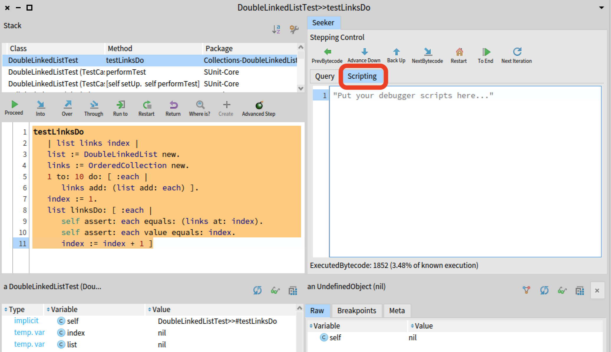

# SeekerDebugger

## Baseline

Seeker Prototype Queryable Time-Traveling Debugger.

Do this:
```Smalltalk
Metacello new
    baseline: 'Seeker';
    repository: 'github://maxwills/SeekerDebugger:main';
    onWarning: [ :ex | ex resume ];
    load.
```
Requires the following projects (installed automatically with this Seeker Baseline):

- https://github.com/maxwills/auto-type
- https://github.com/maxwills/mock-flex

The baseline will:
- Enable the debugger extension in the StDebugger UI.
- Change the `StDebugger` `debuggerActionModel` default class to `SeekerStDebuggerActionModel`. This will make the StDebugger to need Seeker to be enabled to work. (You can still debug normaly without Seeker, but it will be shown at the right, even if it is not used). Don't use this if you rely on your own modifications of `StDebuggerActionModel`. If you unload Seeker, you will need to manually restore `StDebugger>>#debuggerActionModel`.
- Add a line to `HandMorph>>handleEvent:` to capture the pressed state of modifier keys.


## Limitations and known issues.
- Supports "Debug it" and TestCases when launched from the corresponding seeker menu entry. No support for non intentional debugging.
- No complete support for test clean up at the moment.
- Single thread executions only.
- No UI executions support.
- The execution reversal mechanism can only undo changes that originates from within an execution (the debugged execution call tree). Changes made from outside the execution could affect the reversal mechanism.
- Performance: Executing code with Seeker is slow. The emergency stop (STOP button in the toolbar) might be useful. Consider closing it by force if necessary.
- No support yet for "Debug Drive development". Modifying the debugged code during a debug session might produce problems with time-indices.

## Quick reference:
The Quick Reference pdf document is included in the repository, and can be accessed [here](./Resources/TTQs-QuickReference.pdf).

## UI Integrated Query Example

To show query results in the UI (the Query Tab of Seeker), follow this example.

1. Go to the Scripting Tab, as shown here. 
  


2. Paste and execute the following code.
```Smalltalk
|query t|
"Lists the variable name for all the assignments of an execution."
t := AutoType new.
query := Query from: seeker programStates
 select: [:state| state node isAssignment] 
 collect: [:state| t newWith
		bytecodeIndex: state bytecodeIndex;
		varNam: state node variable variable name;
		endWith]
.
seeker ui showResult: query asSeekerResultsCollection  
```
3. See the results in the Query Tab. Click on any bytecodeIndex to time-travel to the result.

### Time-Traveling Queries Notes:

- The Query object instantiation doesn't trigger the production of results.
- The method asSeekerResultsCollection triggers the query evaluation, and additionally produces a Seeker UI-friendly object containing the resulting collection.
- The field bytecodeIndex is mandatory. Include it like in the example.
- AutoType automatically creates a class (and instances. The class is not registered in the system) that serves the collection function. To make time traveling queries, it is mandatory to include the bytecodeIndex field.

### Notes
	Remember:
	HandMorph handleEvent: SeekerGlobals instance updateModifierKeys: anEvent.
	
### 2021/11 functionalities

- Command queries not executed in the UI thread (A status bar updates during their execution). However, the waiting cursor is now missing.
- New scripting functions:  
```Smalltalk
"setting custom execution boundaries"
seeker recordFromHereWithExecutionEndingConditionOnState: [:state| state bytecodeIndex = 2   ].
seeker recordOnThisContext.

"stepping to a marker"
seeker stepToNextMarker.
"other stepping"
seeker timeTravelToBytecodeIndex:  1001.
seeker stepBytecodes: 100.

"Not new, but useful to remember"
seeker timeTravelToTraceTime: 5 asExecutedBytecodeTraceTime 

```
